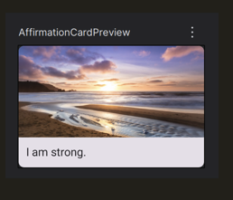
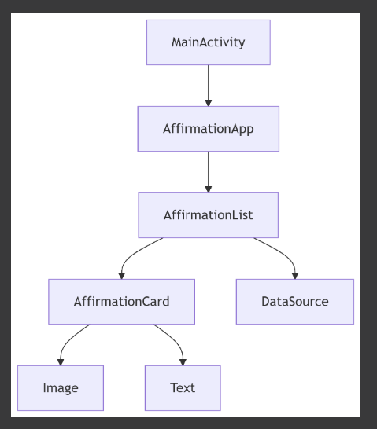

# 📱 Image Scroller dengan Jetpack Compose

  **Nama:** Nabilah Atika Rahma  
  **NRP:** 5025221005  
  **Kelas:** PPB G - Task 8

## ✅ Project Overview



This documentation explains how to build a vertically scrollable list of affirmation cards using Jetpack Compose. The project displays a collection of positive affirmations, each featuring an inspirational image and text within a material design card component.

---

## 🎯 Objectives

The main objectives of this project are:
- To create a clean user interface displaying motivational content
- To implement efficient list rendering using Jetpack Compose
- To demonstrate modern Android UI development practices

---

## 📁 Project Structure

```
ImageScroller/
├── MainActivity.kt
├── model/
│   ├── Affirmation.kt
│   ├── AffirmationData.kt
│   └── DataSource.kt
├── ui/
│   ├── theme/
│   │   ├── Color.kt
│   │   ├── Shape.kt
│   │   ├── Theme.kt
│   │   └── Type.kt
├── res/
│   ├── drawable/ (berisi gambar afirmasi)
│   └── values/
│       └── strings.xml
```

---

## 🧩 Component Breakdown



### `MainActivity.kt`
The main entry point of the application. Hosts the `AffirmationApp()` composable which serves as the root UI component.

```kotlin
class MainActivity : ComponentActivity() {
    override fun onCreate(savedInstanceState: Bundle?) {
        super.onCreate(savedInstanceState)
        setContent {
            ImageScrollerTheme {
                AffirmationApp()
            }
        }
    }
}
```

### `Affirmation.kt`
Defines the data model for each affirmation card.

```kotlin
data class Affirmation(@StringRes val stringResourceId: Int, @DrawableRes val imageResourceId: Int)
```

### `DataSource.kt`
Provides the data layer abstraction, loading affirmations from resources.

```kotlin
class DataSource() {
    fun loadAffirmations(): List<Affirmation> {
        return listOf(
            Affirmation(R.string.affirmation1, R.drawable.image1),
            // Additional affirmations...
        )
    }
}
```

### `UI Components`
- AffirmationCard: A reusable composable for individual affirmation items
- AffirmationList: Handles the scrollable list using LazyColumn
- Theme: Custom material theme configuration

---

## 🖥️ UI Preview

Each affirmation is displayed in a Material Card containing:
- 🖼️ Inspirational image (scaled and cropped properly)
- 💬 Positive affirmation text
- ♻️ Recyclable list items for performance

The entire list features:
- Smooth vertical scrolling
- Consistent padding and spacing
- Responsive layout for different screen sizes

---


## 🚀 Getting Started

Prerequisites
1. Android Studio (latest stable version)
2. Android SDK (API level 21+)
3. Basic Kotlin knowledge

Installation
1. Clone the repository
2. Open project in Android Studio
3. Sync Gradle dependencies
4. Run on emulator or physical device

Build Instructions
1. Clean project: Build > Clean Project
2. Rebuild project: Build > Rebuild Project
3. Run app: Click the Run button ▶️

## ✅ Key Takeaways

Through this project, we've demonstrated:
- Efficient list handling with LazyColumn
- Modern UI development with Jetpack Compose
- Proper separation of concerns (data vs UI)
- Material Design implementation best practices

The project showcases how Jetpack Compose enables developers to build beautiful, performant UIs with less code compared to traditional View-based systems.


## 🔗 References

- [Jetpack Compose Documentation](https://developer.android.com/jetpack/compose)
- [Android Basics in Compose Course](https://developer.android.com/courses/android-basics-compose/unit-1)

